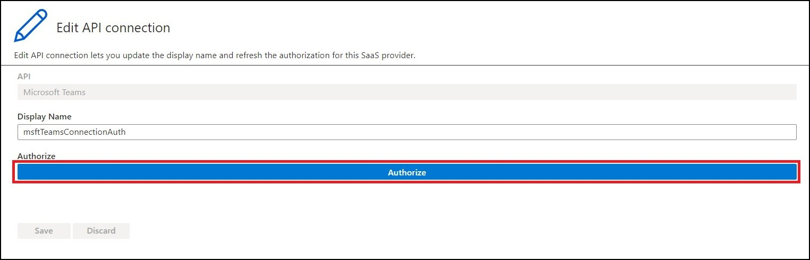

## Table Of Contents:
1. Synapse Data Exporter Scenarios
2. Setfup and Configure Notifications for MS Teams and Outlook

## Synapse Data Exporter Scenarios

#### Scenario1: Take schema name, table name from the user then copy data from synapse exporter to azure blob storage with support of CSV, JSON, JSONL and PARQUET.

#### Prerequisites:
1. Resource group for the deployment.
2. Azure Synapse Analytics

#### To be provided
1. Resource Group
2. Data Factory Name
3. Location
4. Storage Account Name (option for **new** or **existing**)
5. Sql DB Pool Name
6. Synapse Workspace Name
7. Administration Login: synapse username
8. Administration Password
9. Schema Name: Name of schema from which you want to copy data
10. Table Name: Any table from the given schema that you want to copy
11. Container Name: The name of blob storage container where you want to copy data
12. Dataset Name: write the name of dataset that wil be renamed once it is copied to blob storage
13. Logic App Name

Click the following button to deploy all the resources.

Once the template is deployed following resources will be created 
1. Azure Data Factory
2. Storage Account
3. API connection for ms teams
4. API connection for outlook
5. App logic

Open the deployed data factory it will contain four pipelines for copying data to blob storage with support of CSV, JSON, JSONL and Parquet formats as shown below.

Pipeline For Exporting Data To CSV Format
You need to provide following parameters before for executing the pipeline
1. schemaName
2. tableName
3. tontainerName
4. tatasetName
5. EmailTo

Pipeline For Exporting Data To JSON Format
You need to provide following parameters before for executing the pipeline
1. schemaName
2. tableName
3. tontainerName
4. tatasetName
5. EmailTo

Pipeline For Exporting Data To JSONL Format
You need to provide following parameters before for executing the pipeline
1. schemaName
2. tableName
3. tontainerName
4. tatasetName
5. EmailTo

Pipeline For Exporting Data To PARQUET Format
You need to provide following parameters before for executing the pipeline
1. schemaName
2. tableName
3. tontainerName
4. tatasetName
5. EmailTo

#### Setup and Configure Notifications for MS Teams and Outlook

Once template is deployed you will find the app logic resouorce created, it will contain the logic for sending notification to ms teams and outlook

#### Authenticating Microsoft Teams account with Azure Logic App

1. First, navigate to the resource group that contains your deployment and find the resource titled **"msftTeamsConnectionAuth"**. Click on it and navigate to its **"Edit API connection"** option from the sidebar. 

2. In the window there will be a button titled **"Authorize"**, click on it and it will open up Microsoft sign-in page. Enter the team account credentials and it will authorize you to your team's account.

3. Click on **"Save"** to save the authorization information and navigate to resource group.

4. Now click on the deployed logic app, the default name of which is **"TeamsNotify"**. Click on the option **"Logic app designer"** from the sidebar under heading **"Development tools"**. This will open a visual editor, if there was problem connecting to teams then it will display connection error. In that case, refer back to step 1.

#### Authenticating Microsoft Outlook account with Azure Logic App

1. First, navigate to the resource group that contains your deployment and find the resource titled **"outlook"**. Click on it and navigate to its **"Edit API connection"** option from the sidebar. 

2. In the window there will be a button titled **"Authorize"**, click on it and it will open up Microsoft sign-in page. Enter the outlook account credentials and it will authorize you to your outlook's account.

3. Click on **"Save"** to save the authorization information and navigate to resource group.

4. Now click on the deployed logic app, the default name of which is **"TeamsNotify"**. Click on the option **"Logic app designer"** from the sidebar under heading **"Development tools"**. This will open a visual editor, if there was problem connecting to teams then it will display connection error. In that case, refer back to step 1.

#### Scenario2: Take schema name then copy all tables of that schema from synapse exporter to azure blob storage with support of CSV, JSON, JSONL and PARQUET.

#### Scenario3: Copy all data from  into azure blob storage with support of CSV, JSON, JSONL and PARQUET.

<h2> Click on button to deploy Azure Data Factory pipeline which copies data from synapse data ware house to storage account </h2>

<h2> Click on button to deploy Azure Data Factory pipeline which copies All tables data of particular schema from synapse data ware house to storage account </h2>

<h2> Click on button to deploy Azure Data Factory pipeline which copies all schema tables from synapse data ware house to storage account </h2>

