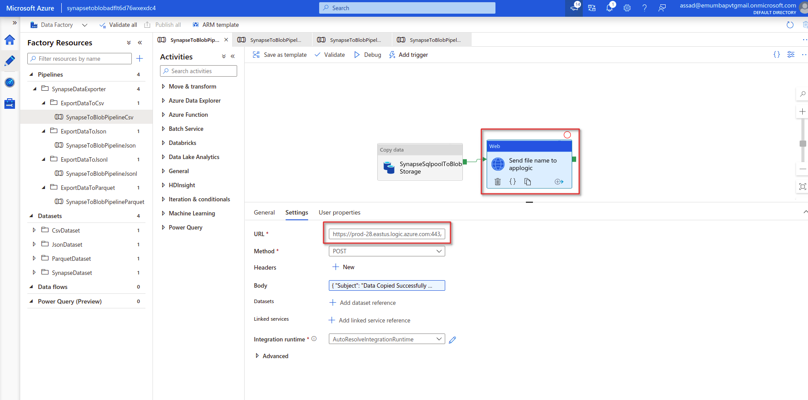

## Table Of Contents:
1. Synapse Data Exporter Scenarios
	a) Scenario1: Take schema name, table name from the user then copy data from synapse exporter to azure blob storage with support of CSV, JSON, JSONL and PARQUET.
	b) Scenario2: Take schema name then copy all tables of that schema from synapse exporter to azure blob storage with support of CSV, JSON, JSONL and PARQUET.
	c) Scenario3: Copy all data from into azure blob storage with support of CSV, JSON, JSONL and PARQUET.
2. Pipeline workflow explanation for each scenario
3. Setfup and Configure Notifications for MS Teams and Outlook for each scenario
 

## Synapse Data Exporter Scenarios

#### Scenario1
#### Take schema name, table name from the user then copy data from synapse exporter to azure blob storage with support of CSV, JSON, JSONL and PARQUET.

#### Prerequisites:
1. Resource group for the deployment.
2. Azure Synapse Analytics

#### To be provided
1. Resource Group
2. Data Factory Name
3. Location
4. Storage Account Name (option for **new** or **existing**)
5. Sql DB Pool Name
6. Synapse Workspace Name
7. Administration Login: synapse username
8. Administration Password
9. Schema Name: Name of schema from which you want to copy data
10. Table Name: Any table from the given schema that you want to copy
11. Container Name: The name of blob storage container where you want to copy data
12. Dataset Name: write the name of dataset that wil be renamed once it is copied to blob storage
13. Logic App Name

Click the following button to deploy all the resources.

Once the template is deployed following resources will be created 
1. Azure Data Factory
2. Storage Account
3. API connection for ms teams
4. API connection for outlook
5. App logic

Open the deployed data factory it will contain four pipelines for copying data to blob storage with support of CSV, JSON, JSONL and Parquet formats as shown below.

Pipeline For Exporting Data To CSV Format
You need to provide following parameters before for executing the pipeline
1. schemaName
2. tableName
3. containerName
4. datasetName
5. EmailTo

Pipeline For Exporting Data To JSON Format
You need to provide following parameters before for executing the pipeline
1. schemaName
2. tableName
3. containerName
4. datasetName
5. EmailTo

Pipeline For Exporting Data To JSONL Format
You need to provide following parameters before for executing the pipeline
1. schemaName
2. tableName
3. containerName
4. datasetName
5. EmailTo

Pipeline For Exporting Data To PARQUET Format
You need to provide following parameters before for executing the pipeline
1. schemaName
2. tableName
3. containerName
4. datasetName
5. EmailTo

#### Pipeline workflow explanation

#### Step1: Two linked services are created for synapse analytics and blob storage account

Synapse analytics linked service for establishing connection with it.

Azure Blob Storage linked service for establishing connection with it.

#### Step2: Copy activity
 
 Copy actvity is used which gets the table name from the synapse analytics and copies into the given blob storage account.
 Copy activity source contains synapse linked service and takes values of schema name and table name by using tableName and schemaName parameters
 

 In the sink of copy activity, dataset of desired format is selected and required parameters value is given
 

#### Step3: Web Activity is used to send file name to logic app for notifications along with other parameters

Inside settings of web activity **logic app end point URL** is provided and required parameters values are passed in the body 

#### Step4: Setup and Configure Notifications for MS Teams and Outlook

Once template is deployed you will find the app logic resouorce created, it will contain the logic for sending notification to ms teams and outlook

#### Step5 Authenticating Microsoft Teams account with Azure Logic App

1. First, navigate to the resource group that contains your deployment and find the resource titled **"msftTeamsConnectionAuth"**. Click on it and navigate to its **"Edit API connection"** option from the sidebar. 

2. In the window there will be a button titled **"Authorize"**, click on it and it will open up Microsoft sign-in page. Enter the team account credentials and it will authorize you to your team's account.

3. Click on **"Save"** to save the authorization information and navigate to resource group.

4. Now click on the deployed logic app, the default name of which is **"TeamsNotify"**. Click on the option **"Logic app designer"** from the sidebar under heading **"Development tools"**. This will open a visual editor, if there was problem connecting to teams then it will display connection error. In that case, refer back to step 1.

#### Authenticating Microsoft Outlook account with Azure Logic App

1. First, navigate to the resource group that contains your deployment and find the resource titled **"outlook"**. Click on it and navigate to its **"Edit API connection"** option from the sidebar. 

2. In the window there will be a button titled **"Authorize"**, click on it and it will open up Microsoft sign-in page. Enter the outlook account credentials and it will authorize you to your outlook's account.

3. Click on **"Save"** to save the authorization information and navigate to resource group.

4. Now click on the deployed logic app, the default name of which is **"TeamsNotify"**. Click on the option **"Logic app designer"** from the sidebar under heading **"Development tools"**. This will open a visual editor, if there was problem connecting to teams then it will display connection error. In that case, refer back to step 1.

#### Scenario2
#### Take schema name then copy all tables of that schema from synapse exporter to azure blob storage with support of CSV, JSON, JSONL and PARQUET.

#### Prerequisites:
1. Resource group for the deployment.
2. Azure Synapse Analytics

#### To be provided
1. Resource Group
2. Data Factory Name
3. Location
4. Storage Account Name (option for **new** or **existing**)
5. Sql DB Pool Name
6. Synapse Workspace Name
7. Administration Login: synapse username
8. Administration Password
9. Schema Name: Name of schema from which you want to copy data
10. Container Name: The name of blob storage container where you want to copy data
11. Logic App Name

Click the following button to deploy all the resources.

Once the template is deployed following resources will be created 
1. Azure Data Factory
2. Storage Account
3. API connection for ms teams
4. API connection for outlook
5. App logic

Open the deployed data factory it will contain four pipelines for copying data to blob storage with support of CSV, JSON, JSONL and Parquet formats as shown below.

Pipeline For Exporting Data To CSV Format
You need to provide following parameters before for executing the pipeline
1. containerName
2. schemaName
5. EmailTo

Pipeline For Exporting Data To JSON Format
You need to provide following parameters before for executing the pipeline
1. containerName
2. schemaName
5. EmailTo

Pipeline For Exporting Data To JSONL Format
You need to provide following parameters before for executing the pipeline
1. containerName
2. schemaName
5. EmailTo

Pipeline For Exporting Data To PARQUET Format
You need to provide following parameters before for executing the pipeline
1. containerName
2. schemaName
5. EmailTo

#### Pipeline workflow explanation

#### Step1: Two linked services are created for synapse analytics and blob storage account

Synapse analytics linked service for establishing connection with it.

Azure Blob Storage linked service for establishing connection with it.

#### Step2: Lookup activity for getting tables list
   
   Lookup activity is used to get the tables information. In the settings tab source dataset synapse linked service is selected from where data will be fetched.
   In the query section query is written which fetches all the tables of given schema
   

#### Step3: For each activity 
   
   For each activity is used which iterates the table name one by one
 

 
 
#### Step4: Copy activity inside For each activity
 
 Copy actvity is used which gets the each table name from the synapse analytics and copies into the given blob storage account.
 Copy activity source contains synapse linked service and takes values of schema name and table name by using tableName and schemaName parameters
 

 In the sink of copy activity, dataset of desired format is selected and containing parameters of containerName and datasetName
 

Dataset name is created by combining schema name and table table 

#### Step5: Using get variables and set variables activity to get the list of cocpied files

1. Two variables with the names **fileNamesCopy** and **fileName** are created

2. Get variables activity is used inside for each activity to get table name each time the for each activity is executed and which is stored in **fileNamesCopy** variable

3. The value of filename is created by concatenating schema name and table name

4. Set variables activity is used outside the for each activity which will contain the comma separated list of values and will be stored in another variable named **fileName**

#### Step6: Web Activity is used to send list of files to logic app for notifications along with other parameters

Inside settings of web activity **logic app end point URL** is provided and required parameters values are passed in the body 

#### Step7: Authenticating Microsoft Teams account with Azure Logic App

1. First, navigate to the resource group that contains your deployment and find the resource titled **"msftTeamsConnectionAuth"**. Click on it and navigate to its **"Edit API connection"** option from the sidebar. 

2. In the window there will be a button titled **"Authorize"**, click on it and it will open up Microsoft sign-in page. Enter the team account credentials and it will authorize you to your team's account.

3. Click on **"Save"** to save the authorization information and navigate to resource group.

4. Now click on the deployed logic app, the default name of which is **"TeamsNotify"**. Click on the option **"Logic app designer"** from the sidebar under heading **"Development tools"**. This will open a visual editor, if there was problem connecting to teams then it will display connection error. In that case, refer back to step 1.

#### Step8: Authenticating Microsoft Outlook account with Azure Logic App

1. First, navigate to the resource group that contains your deployment and find the resource titled **"outlook"**. Click on it and navigate to its **"Edit API connection"** option from the sidebar. 

2. In the window there will be a button titled **"Authorize"**, click on it and it will open up Microsoft sign-in page. Enter the outlook account credentials and it will authorize you to your outlook's account.

3. Click on **"Save"** to save the authorization information and navigate to resource group.

4. Now click on the deployed logic app, the default name of which is **"TeamsNotify"**. Click on the option **"Logic app designer"** from the sidebar under heading **"Development tools"**. This will open a visual editor, if there was problem connecting to teams then it will display connection error. In that case, refer back to step 1.

#### Step9: Logic App contains the logic for sending notifications from azure data factory to ms teams and outlook 

1. Inside the logic app designere action of **when a HTTP request is received** is selected which contains the json paylod. This will also provide end point url of logic app.

2. New action for ms teams **Post a message V3** is added which will be used to send notification to ms teams.

3. New action for Microsoft outlook **Send an email V2** is added which will be used to send notification via email.

#### Scenario3
#### Copy all data from  into azure blob storage with support of CSV, JSON, JSONL and PARQUET.

#### Prerequisites:
1. Resource group for the deployment.
2. Azure Synapse Analytics

#### To be provided
1. Resource Group
2. Data Factory Name
3. Location
4. Storage Account Name (option for **new** or **existing**)
5. Sql DB Pool Name
6. Synapse Workspace Name
7. Administration Login: synapse username
8. Administration Password
9. Container Name: The name of blob storage container where you want to copy data
10. Logic App Name

Click the following button to deploy all the resources.

Once the template is deployed following resources will be created 
1. Azure Data Factory
2. Storage Account
3. API connection for ms teams
4. API connection for outlook
5. App logic

Open the deployed data factory it will contain four pipelines for copying data to blob storage with support of CSV, JSON, JSONL and Parquet formats as shown below.

Pipeline For Exporting Data To CSV Format
You need to provide following parameters before for executing the pipeline
1. containerName
2. EmailTo

Pipeline For Exporting Data To JSON Format
You need to provide following parameters before for executing the pipeline
1. containerName
2. EmailTo

Pipeline For Exporting Data To JSONL Format
You need to provide following parameters before for executing the pipeline
1. containerName
2. EmailTo

Pipeline For Exporting Data To PARQUET Format
You need to provide following parameters before for executing the pipeline
1. containerName
2. EmailTo

#### Pipeline workflow explanation

#### Step1: Two linked services are created for synapse analytics and blob storage account

Synapse analytics linked service for establishing connection with it.

Azure Blob Storage linked service for establishing connection with it.

#### Step2: Lookup activity for getting tables list
   
   Lookup activity is used to get the tables information. In the settings tab source dataset synapse linked service is selected from where data will be fetched.
   In the query section query is written which fetches all the tables of given schema
   

Query is written for getting all schemas tables

#### Step3: For each activity 
   
   For each activity is used which iterates the table name one by one
 

 
 
#### Step4: Copy activity inside For each activity
 
 Copy actvity is used which gets the each table name from the synapse analytics and copies into the given blob storage account.
 Copy activity source contains synapse linked service and takes values of schema name and table name by using tableName and schemaName parameters
 

 In the sink of copy activity, dataset of desired format is selected and containing parameters of containerName and datasetName
 

Dataset name is created by combining schema name and table table 

#### Step5: Using get variables and set variables activity to get the list of cocpied files

1. Two variables with the names **fileNamesCopy** and **fileName** are created

2. Get variables activity is used inside for each activity to get table name each time the for each activity is executed and which is stored in **fileNamesCopy** variable

3. The value of filename is created by concatenating schema name and table name

4. Set variables activity is used outside the for each activity which will contain the comma separated list of values and will be stored in another variable named **fileName**

#### Step6: Web Activity is used to send list of files to logic app for notifications along with other parameters

Inside settings of web activity **logic app end point URL** is provided and required parameters values are passed in the body 

#### Step7: Authenticating Microsoft Teams account with Azure Logic App

1. First, navigate to the resource group that contains your deployment and find the resource titled **"msftTeamsConnectionAuth"**. Click on it and navigate to its **"Edit API connection"** option from the sidebar. 

2. In the window there will be a button titled **"Authorize"**, click on it and it will open up Microsoft sign-in page. Enter the team account credentials and it will authorize you to your team's account.

3. Click on **"Save"** to save the authorization information and navigate to resource group.

4. Now click on the deployed logic app, the default name of which is **"TeamsNotify"**. Click on the option **"Logic app designer"** from the sidebar under heading **"Development tools"**. This will open a visual editor, if there was problem connecting to teams then it will display connection error. In that case, refer back to step 1.

#### Step8: Authenticating Microsoft Outlook account with Azure Logic App

1. First, navigate to the resource group that contains your deployment and find the resource titled **"outlook"**. Click on it and navigate to its **"Edit API connection"** option from the sidebar. 

2. In the window there will be a button titled **"Authorize"**, click on it and it will open up Microsoft sign-in page. Enter the outlook account credentials and it will authorize you to your outlook's account.

3. Click on **"Save"** to save the authorization information and navigate to resource group.

4. Now click on the deployed logic app, the default name of which is **"TeamsNotify"**. Click on the option **"Logic app designer"** from the sidebar under heading **"Development tools"**. This will open a visual editor, if there was problem connecting to teams then it will display connection error. In that case, refer back to step 1.

#### Step9: Logic App contains the logic for sending notifications from azure data factory to ms teams and outlook 

1. Inside the logic app designere action of **when a HTTP request is received** is selected which contains the json paylod. This will also provide end point url of logic app.

2. New action for ms teams **Post a message V3** is added which will be used to send notification to ms teams.

3. New action for Microsoft outlook **Send an email V2** is added which will be used to send notification via email.

